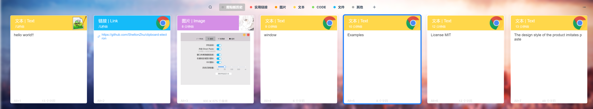
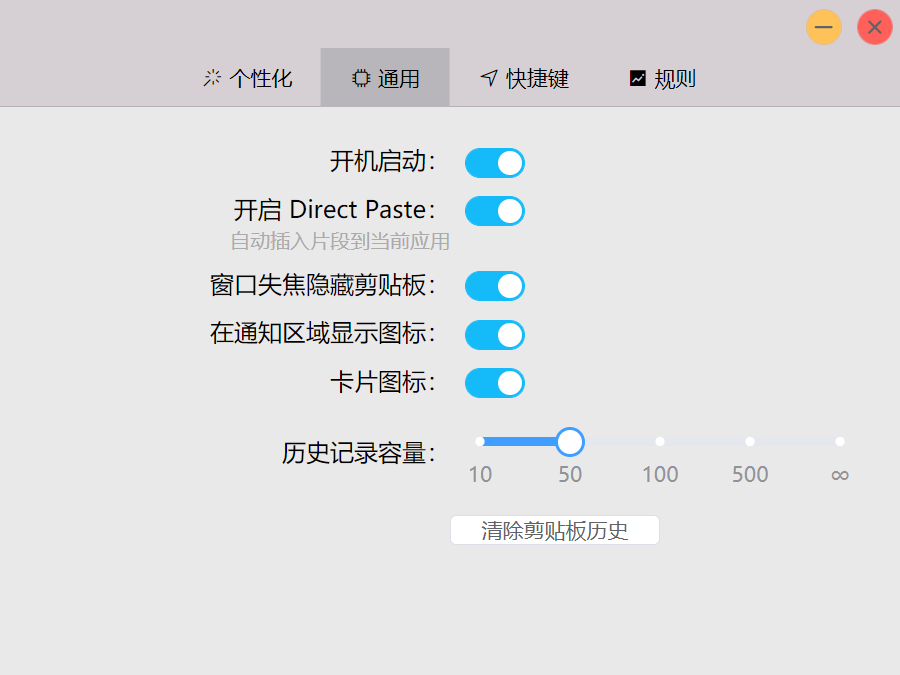
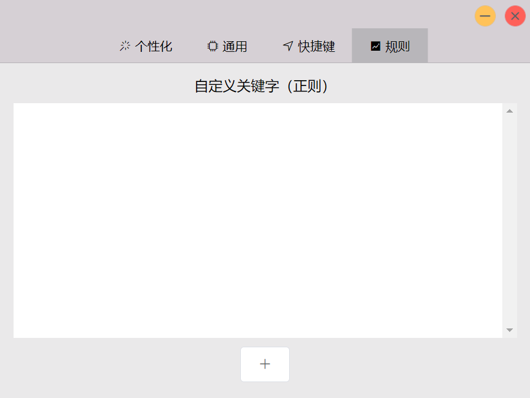

# Clipboard-Electron

This app is a clipboard programed by Electorn and it supports Windows only.

The design style of this app imitates [Paste](https://pasteapp.io/) on Mac.
## Sample
### Main window

### Setting window

---

## Development
### Environment
node `v14.15.2`

npm `6.14.9` or yarn `1.22.10`

vue-cli `4.5.9`

#### Building require
installation:
* Windows
    * windows-build-tools npm package (`npm install --global --production windows-build-tools` from an elevated PowerShell or CMD.exe)
* Mac
    * Xcode Command Line Tools.
* Linux
    * Python (v2.7 recommended, v3.x.x is not supported).
    * make.
    * A C/C++ compiler like GCC.
    * libxtst-dev and libpng++-dev (`sudo apt-get install libxtst-dev libpng++-dev`).

Install node-gyp using npm:

`npm install -g node-gyp` or `yarn global add node-gyp`

Then build:

`npm run postinstall` or `yarn postinstall`

***

### Project setup
`yarn` or `npm install`

#### Compiles and hot-reloads for development
`yarn serve` or `npm run serve`

#### Compiles and minifies for production
`yarn build` or `npm run build`

#### Lints and fixes files
`yarn lint` or `npm run lint`

#### Customize configuration
See [Configuration Reference](https://cli.vuejs.org/config/).

#### Compiles electron app for development
`yarn electron:serve` or `npm run electron:serve`

#### Compiles and minifies electron app for production
`yarn electron:build` or `npm run electron:build`

#### Electron document
See [Electron Documentation](https://www.electronjs.org/docs).

---

## License
[MIT](license.txt)